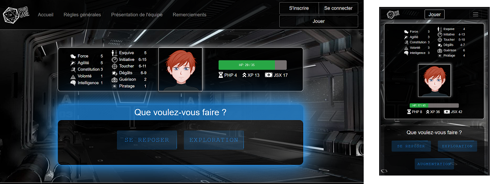

# Unnamed-Game

Unnamed Game est un jeu inspiré dans sa conception des livres dont vous êtes le héros et des jeux de rôle dans un univers de science-fiction. Si vous le souhaitez, une vidéo de [présentation est disponible ici](https://youtu.be/ebmtTjRXzp0?t=4378) et vous pouvez également [le découvrir en ligne ici](https://unnamed-game.fr/).

La première partie du jeu est scriptée afin de vous laisser découvrir les actions qui vous seront proposées par la suite. Puis, vous entrez dans la phase non scriptée du jeu. Désormais, vous découvrez le main hub et la possibilité de choisir entre ces différentes actions. Cependant toutes ne sont pas systématiquement proposées car certaines sont conditionnées à votre évolution dans le jeu et / ou proposées aléatoirement. 

Ce jeu a été conçu en 1 mois par 5 jeunes développeurs, dont moi-même, de l'établissement des documents de conception (cahier des charges, modèles conceptuels de données, wireframes...) au déploiement, en passant bien évidemment par les phases de développement et de recettage.

Le Front a été réalisé avec React pour sa réactivité, permettant ainsi d'offrir au joueur une expérience de jeu fluide, et en mobile-first car nous souhaitions que le jeu puisse être découvert tant sur mobile que sur desktop.

Le Back est conçu avec le framework Symfony. Il fournit une API contenant les données du jeu (comme par exemple, les adversaires de combat et leurs statistiques ou les contenus narratifs) mais également un back-office permettant de créer, modifier ou supprimer chacun de ces éléments aisément.

